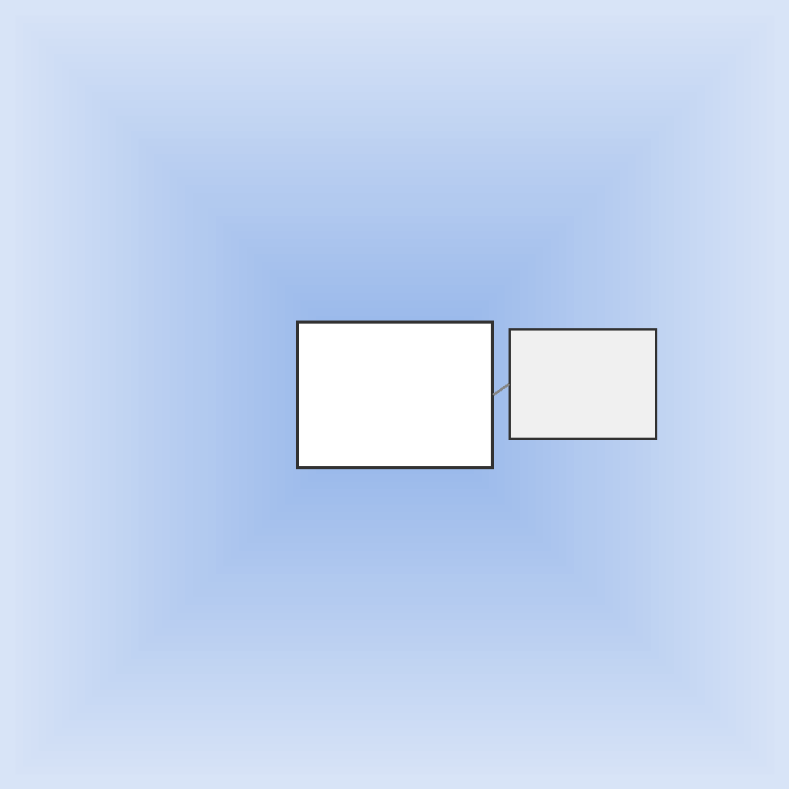

# Monitor Layout Manager

**The easiest way to manage multiple monitors on macOS.**

<div align="center">


## Get Started in 30 Seconds

1. **[Download the latest release](https://github.com/arturgrochau/monitor-setup-tool/releases/latest)**
2. Pick your Mac type: **Apple Silicon** (M1/M2/M3/M4) or **Intel** (2020 and earlier)
3. Unzip and double-click **`Monitor Layout Manager.app`**
4. **macOS Security:** System Settings › Privacy & Security › **Open Anyway**



</div>

## What It Does

- **Drag & drop** monitor boxes to arrange them visually
- **Save layouts** like "Home", "Office", "Presentation"
- **Switch instantly** between saved configurations
- **HiDPI auto-recommendation** — suggests the right scaling for each monitor
- **No terminal needed** — just download and run

## Requirements

- macOS 13 (Ventura) or later
- [displayplacer](https://github.com/jakehilborn/displayplacer) — installed automatically on first launch if missing

## How to Use

1. **Arrange:** Drag monitor boxes to match your physical layout
2. **Save:** Click "Save Layout" → give it a name (e.g. "Work Setup")
3. **Switch:** Click "Load Layout" → select a layout → "Apply Current Arrangement"

## First Run — macOS Security

macOS will ask for permission on the first launch:

1. Right-click the app → Open (or go to System Settings › Privacy & Security › "Open Anyway")
2. Click "Allow" when asked about display control

## Building from Source

See [DEVELOPMENT.md](DEVELOPMENT.md) for full instructions.

**Quick start:**

```bash
pip install -r requirements.txt
python main.py
```

## Troubleshooting

**App crashes immediately:**
- Run `python main.py --cli doctor` from the project directory to diagnose

**displayplacer not found:**
```bash
brew install jakehilborn/jakehilborn/displayplacer
```

**Intel Mac (Homebrew in /usr/local):**
The app auto-discovers displayplacer in both `/opt/homebrew/bin` and `/usr/local/bin`.

**Open an issue:** [github.com/arturgrochau/monitor-setup-tool/issues](https://github.com/arturgrochau/monitor-setup-tool/issues)

---

*Created by [Artur Grochau](https://github.com/arturgrochau) • Built with Python & Tkinter*
