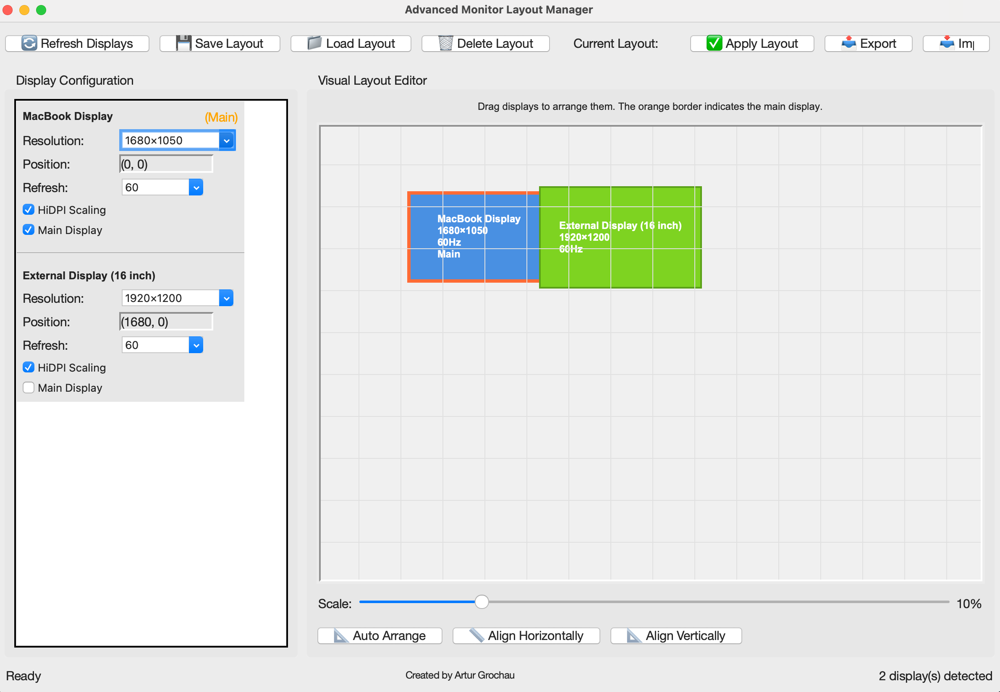

# Monitor Layout Manager


[](https://github.com/arturgrochau/monitor-setup-tool/releases/latest)
[](https://support.apple.com/macos)
[](https://www.python.org)
[](LICENSE)

Professional macOS monitor layout manager with drag-and-drop interface.

## 🚀 Get Started in 30 Seconds

1. **[Download ZIP](https://github.com/arturgrochau/monitor-setup-tool/releases/download/v1.5.0/Monitor_Layout_Manager_macOS.zip)**
2. **Unzip** and double-click **`Monitor Layout Manager.app`**
3. **macOS Security:** System Settings > Privacy & Security > "Allow Anyway"
4. **Done!** 🎉

> **Just want to try it?** Double-click the `Monitor Layout Manager.app` after download. It handles everything automatically.

## ✨ What It Does

🖱️ **Drag & drop** monitors to arrange them  
💾 **Save layouts** like "Home", "Office", "Presentation"  
⚡ **One-click switching** between saved layouts  
🔄 **Auto-detects** all connected displays  
⚙️ **HiDPI scaling** and resolution control  

## 🔧 System Requirements

- macOS 10.15+ (Catalina or newer)
- Python 3.8+ (usually pre-installed)
- GUI support: `brew install python-tk` (if GUI doesn't launch)
- Any monitor setup (USB-C, HDMI, DisplayPort, etc.)

## 🆘 Need Help?

**🔧 GUI not launching?** Install GUI support: `brew install python-tk`  
**🔧 Still not working?** Run `./install.sh` in terminal first  
**📚 Want more?** Check the [Complete Guide](devtools/docs/README_detailed.md)  
**🐠 Fish user?** See [Fish Integration](devtools/docs/FISH_GUIDE.md)  

**🍎 macOS blocked the app?**
1. Go to **System Settings > Privacy & Security**
2. Scroll to "Security" and click **"Allow Anyway"** for `monitor-layout`
3. Double-click `monitor-layout` again to launch  

---

## 🔌 Advanced: Command Line Interface

<details>
<summary>For developers and automation enthusiasts</summary>

### Quick CLI Commands
```bash
# Launch GUI (same as double-clicking)
./monitor-layout

# CLI mode  
./monitor-layout --cli detect        # Show all monitors
./monitor-layout --cli save "Work"   # Save current as "Work" 
./monitor-layout --cli load "Work"   # Apply "Work" layout
./monitor-layout --cli list-layouts  # Show all saved layouts
```

### Full CLI Reference
```bash
# Display management
./monitor-layout --cli detect                    # Detect displays
./monitor-layout --cli doctor                    # System diagnostics

# Layout operations  
./monitor-layout --cli save -n "Name" -d "Desc"  # Save with description
./monitor-layout --cli load "Layout Name"        # Apply saved layout
./monitor-layout --cli delete "Layout Name"      # Remove layout
./monitor-layout --cli list-layouts             # List all layouts

# Backup & sharing
./monitor-layout --cli backup                   # Create backup
./monitor-layout --cli export layouts.json     # Export all layouts  
./monitor-layout --cli import layouts.json     # Import layouts
```

</details>

---

<div align="center">

**Created by [Artur Grochau](https://github.com/arturgrochau)**

</div>
