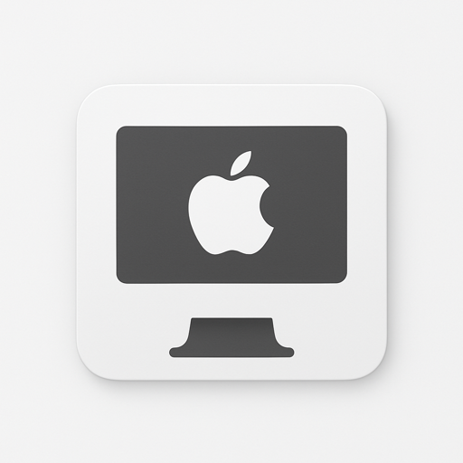

# 🖥️ Monitor Layout Manager

A sophisticated **macOS-only** monitor layout manager with visual drag-and-drop configuration and powerful CLI automation.

<div align="center">


### 🚀 One-Click Download

**[📥 Download App (ZIP)](https://github.com/arturgrochau/monitor-setup-tool/releases/latest/download/Monitor-Layout-Manager-v1.0.0-macOS.zip)** • **[🔗 View Releases](https://github.com/arturgrochau/monitor-setup-tool/releases)** • **[📚 Documentation](#-features)**

**Ready-to-Run macOS App**: Download the ZIP, extract, and double-click the `.app` file - no installation needed!



</div>

---

## 🖥️ Overview

**Monitor Layout Manager** is a production-ready **macOS application** that allows you to:

- **🎨 Visual Configuration**: Drag-and-drop interface with 876-line sophisticated GUI
- **💾 Layout Management**: Save and instantly switch between custom monitor configurations  
- **🚀 CLI Automation**: Advanced command-line interface for scripting and automation
- **🐚 Shell Universal**: Works with bash, zsh, fish, and other shells
- **🔧 HiDPI Support**: Enable and manage HiDPI scaling with `.plist` patches
- **📱 Cross-Shell**: Shell-neutral scripts work everywhere

### ✨ Key Features
- **Dynamic Display Detection**: Automatically detects connected monitors (MacBook, external displays)
- **Custom Named Layouts**: Create layouts like "Work", "Home", "Presentation Mode"
- **Visual Positioning**: Canvas-based drag-and-drop display arrangement
- **Advanced CLI**: Rich output formatting, debug mode, export/import capabilities
- **Professional Integration**: Uses `displayplacer` for reliable monitor configuration

---

## ⚡ Quick Start

### 🖥️ For End Users (Recommended)

**Download the ready-to-run app:**
1. **[📥 Download the App ZIP](https://github.com/arturgrochau/monitor-setup-tool/releases/latest/download/Monitor-Layout-Manager-v1.0.0-macOS.zip)**
2. **Extract the ZIP** and double-click `Monitor Layout Manager.app`
3. **Allow permissions** when macOS prompts for display control
4. **Start creating layouts!** - Drag monitors around, save as "Home", "Work", etc.

*No installation, dependencies, or terminal commands required!*

### 🛠️ For Developers

**Build from source:**

```bash
git clone https://github.com/arturgrochau/monitor-setup-tool.git
cd monitor-setup-tool
./install.sh                    # Installs everything + opens GUI automatically
```

### 🖥️ Daily Usage

```bash
# Launch the visual interface (most common)
./monitor-layout                 # GUI opens automatically

# Save your current setup & switch between layouts
# Use the GUI to save layouts with custom names like "Work", "Home"
# Use the dropdown in the GUI to switch instantly between saved layouts
```

### 🛠️ Alternative Installation

<details>
<summary>Manual Setup (if you prefer step-by-step)</summary>

```bash
# 1. Dependencies
brew install jakehilborn/jakehilborn/displayplacer python-tk

# 2. Python Environment
python3 -m venv .venv
source .venv/bin/activate
pip install -r requirements.txt

# 3. Launch
./monitor-layout
```
</details>

---

## 🎯 System Requirements

<div align="center">

| Requirement      | Status           | Installation                                                                                      |
| ---------------- | ---------------- | ------------------------------------------------------------------------------------------------- |
| **macOS**        | Required         | Built-in ✅                                                                                        |
| **Python 3.11+** | Required         | `brew install python`                                                                             |
| **tkinter**      | Required for GUI | `brew install python-tk`                                                                          |
| **Homebrew**     | Required         | `/bin/bash -c "$(curl -fsSL https://raw.githubusercontent.com/Homebrew/install/HEAD/install.sh)"` |

</div>

> **⚠️## 🎨 Visual Interface

The GUI provides an intuitive visual experience:

- **🖱️ Drag & Drop**: Visually position monitors on canvas - see exactly how they'll be arranged
- **📐 Real-time Preview**: Changes appear instantly before applying
- **💾 Layout Management**: Save configurations with custom names like "Work", "Home", "Gaming"
- **⚡ One-Click Switching**: Dropdown menu to switch between saved layouts instantly
- **🔧 Advanced Settings**: Resolution, scaling, rotation options for each display
- **🎯 Multiple Profiles**: Perfect for different work scenarios or locations

### Getting Started with the GUI

1. **🚀 Launch**: Run `./monitor-layout` - the GUI opens automatically
2. **🖱️ Arrange**: Drag monitor rectangles to desired positions  
3. **⚙️ Configure**: Set resolution and scaling for each display
4. **💾 Save**: Name your layout (e.g., "Perfect Work Setup")
5. **✅ Apply**: Click "Apply Layout" to activate
6. **🔄 Switch**: Use dropdown to instantly switch between saved setups

<div align="center">

*🖼️ GUI screenshots coming soon - clean drag-and-drop interface*

**Professional Interface** • **Instant Layout Switching** • **Visual Positioning**

</div>

---

## 🧪 Advanced Usage

<details>
<summary>⚡ <strong>Command Line Interface (CLI)</strong> - For automation & scripting</summary>

The CLI provides powerful automation capabilities for power users:

#### 🔍 Display Detection & Info
```bash
./monitor-layout --cli detect                    # Detect all displays
./monitor-layout --cli doctor                    # System diagnostics  
./monitor-layout --cli --debug detect           # Debug mode
```

#### 💾 Layout Management
```bash
./monitor-layout --cli save -n "Layout Name" -d "Description"
./monitor-layout --cli load "Layout Name"
./monitor-layout --cli list-layouts
./monitor-layout --cli delete "Layout Name"
```

#### 📦 Backup & Export
```bash
./monitor-layout --cli backup                   # Create backup
./monitor-layout --cli export layouts.json     # Export layouts
./monitor-layout --cli import-layouts layouts.json
```

#### CLI Examples
```bash
# Morning routine: Switch to work setup
./monitor-layout --cli load work

# Save current dual monitor configuration  
./monitor-layout --cli save -n "dual-4k" -d "Two 4K monitors side by side"

# List all layouts with details
./monitor-layout --cli list-layouts

# Export for backup or sharing
./monitor-layout --cli export ~/Desktop/my-monitor-layouts.json
```

</details>

<details>
<summary>🐟 <strong>Fish Shell Integration</strong> - Enhanced fish completions</summary>

For Fish shell users, get enhanced completions and aliases:

```bash
./scripts/install-fish.fish     # Install fish integration

# New fish aliases available:
mlgui                          # Launch GUI  
mldetect                       # Detect displays
mlsave "Layout Name"           # Save layout
mlload "Layout Name"           # Load layout
mllist                         # List layouts
```

</details>

<details>
<summary>🔧 <strong>Developer Guide</strong> - Project structure and development</summary>

### Project Structure
```
monitor-setup-tool/
├── 🎯 main.py                          # Unified GUI/CLI entry point
├── 📄 README.md                        # This file
├── 🛠️ install.sh                       # Universal installer
├── 🔧 cli/                             # CLI module
├── 🎨 gui/                             # GUI components  
├── 💾 core/                            # Display management
├── 📁 scripts/                         # Helper scripts
├── 🌳 .venv/                           # Virtual environment
└── 📦 requirements.txt                 # Dependencies
```

### Development Setup
```bash
git clone <repository-url>
cd monitor-setup-tool
python3 -m venv .venv
source .venv/bin/activate
pip install -r requirements.txt
./scripts/monitor-cli doctor            # Test setup
```

### Testing
```bash
./scripts/monitor-cli detect            # Test CLI
./monitor-layout                        # Test GUI
python3 -m cli --debug detect          # Debug mode
```

</details>

---

## 🤝 Support & Contributing

<div align="center">

**[🐛 Report Issue](../../issues)** • **[💡 Feature Request](../../issues)** • **[📖 Wiki](../../wiki)**

</div>

### Common Issues

<details>
<summary>❌ <strong>GUI won't launch</strong></summary>

```bash
# Install tkinter
brew install python-tk

# Verify installation  
python3 -c "import tkinter; print('✅ tkinter available')"
```
</details>

<details>
<summary>❌ <strong>CLI command not found</strong></summary>

```bash
# Make scripts executable
chmod +x scripts/monitor-cli scripts/monitor-gui

# Or use direct Python calls
python3 -m cli detect
python3 main.py --cli detect
```
</details>

<details>
<summary>❌ <strong>displayplacer not found</strong></summary>

```bash
# Install displayplacer
brew install jakehilborn/jakehilborn/displayplacer

# Or run installer
./install.sh
```
</details>

---

## 📜 License

This project is released under the MIT License. See `LICENSE` file for details.

---

<div align="center">

**🚀 Ready to manage your monitors like a pro?**

```bash
git clone <repository-url> && cd monitor-setup-tool && ./install.sh
```

**Made with ❤️ for macOS users who love clean setups**

</div>

# 2. Python Environment
python3 -m venv .venv
source .venv/bin/activate
pip install -r requirements.txt

# 3. Global CLI Access (Optional)
mkdir -p ~/bin
ln -s $(pwd)/cli/advanced_cli.py ~/bin/monitor-layout
```

### Verify Installation
```bash
# Test CLI
python -m cli doctor
python -m cli detect

# Test GUI (requires tkinter)
python main.py
```

---

## 🐟 Fish Shell Integration

### Automatic Setup
```fish
# Complete fish integration
fish scripts/install-fish.fish

# Optional: Setup completions symlink
fish scripts/setup-fish-completions.fish
```

### Manual Fish Setup
```fish
# Copy function to fish config
cp scripts/fish-integration.fish ~/.config/fish/functions/monitor-layout.fish

# Reload fish config
source ~/.config/fish/config.fish
```

### Fish Commands & Aliases
```fish
# Direct commands
monitor-layout detect
monitor-layout save -n work
monitor-layout load
monitor-layout gui

# Convenient aliases
mldetect              # Quick display detection
mlgui                 # Launch GUI
mls -n home          # Save layout named "home"
mll                   # Interactive load
mllist                # List all layouts
mldoctor              # System diagnostics

# Helper scripts
scripts/monitor-cli detect    # CLI wrapper
scripts/monitor-gui           # GUI launcher
```

---

## 💻 CLI Commands

### Core Commands
```bash
# 🔍 Display Detection
python -m cli detect                    # Show connected displays
python -m cli detect --detailed        # Detailed display information
python -m cli detect --json-output     # JSON format output

# 💾 Layout Management
python -m cli save -n "work-setup"     # Save current configuration
python -m cli load work-setup          # Apply saved layout
python -m cli load --interactive       # Interactive layout selection
python -m cli list-layouts             # Show all saved layouts
python -m cli delete old-layout        # Remove a layout

# 📦 Import/Export
python -m cli export -o layouts.json   # Export all layouts
python -m cli import-layouts layouts.json --merge

# 🧰 Utilities
python -m cli backup                    # Backup current config
python -m cli doctor                    # System diagnostics
python -m cli gui                       # Launch GUI from CLI
```

### Advanced CLI Features
```bash
# 🐛 Debug Mode
python -m cli --debug detect           # Enable debug output
python -m cli --debug save -n test     # Debug layout saving

# 📊 System Information
python -m cli doctor                    # Comprehensive system check
# - displayplacer installation
# - file permissions
# - display detection test  
# - GUI dependencies check
```

### CLI Examples
```bash
# Morning routine: Switch to work setup
python -m cli load work

# Save current dual monitor configuration
python -m cli save -n "dual-4k" -d "Two 4K monitors side by side"

# List all layouts with details
python -m cli list-layouts
# Output:
# Saved layouts (3):
# • work-setup
#   Description: Office dual monitor configuration  
#   Displays: 2
#   Created: 2025-08-07 14:30
#   Last used: 2025-08-07 15:45

# Export for backup or sharing
python -m cli export -o ~/Desktop/my-monitor-layouts.json
```

---

## 📱 GUI Usage

### Launch GUI
```bash
# Primary GUI entry point
python main.py

# Via CLI
python -m cli gui

# Via fish wrapper
fish scripts/monitor-gui
```

### GUI Features

#### **Visual Display Configuration**
- **Canvas-based Layout**: Drag displays to position them visually
- **Real-time Preview**: See exactly how monitors will be arranged
- **Scale Factor Support**: Handle different display densities
- **Rotation Options**: Configure display orientation

#### **Layout Management**  
- **Save Layouts**: Create named configurations (e.g., "Work", "Home", "Gaming")
- **Quick Switch**: One-click switching between saved layouts
- **Layout Details**: View display count, resolution, creation date
- **Import/Export**: Share layouts between machines

#### **Advanced Settings**
- **HiDPI Configuration**: Enable/disable high-DPI scaling per display
- **Color Depth**: Configure bit depth settings  
- **Refresh Rate**: Set optimal refresh rates
- **Display Arrangement**: Fine-tune positioning and alignment

#### **GUI Workflow Example**
1. **Detect**: GUI automatically scans and displays connected monitors
2. **Arrange**: Drag display rectangles to desired positions
3. **Configure**: Set resolution, scaling, rotation for each display
4. **Save**: Name your layout (e.g., "Perfect Work Setup")  
5. **Apply**: Click "Apply Layout" to activate configuration
6. **Switch**: Use dropdown to switch between saved layouts instantly

---

## 🧪 Developer Tips

### Project Structure
```
monitor-setup-tool/
├── 🎯 main.py                     # GUI entry point
├── 🔧 cli/
│   ├── __main__.py                # CLI module entry
│   └── advanced_cli.py            # Advanced CLI implementation
├── 🎨 gui/
│   ├── advanced_layout_manager.py # 876-line sophisticated GUI
│   ├── display_selector.py        # Display selection components
│   └── settings_dialog.py         # Settings management
├── 💾 core/
│   ├── display_manager.py         # Basic display detection  
│   └── advanced_display_manager.py # Advanced display management
├── 🛠️ utils/helpers.py            # Utility functions
├── 📁 scripts/                    # Helper scripts
│   ├── install-fish.fish          # Fish shell installer
│   ├── monitor-cli                # CLI wrapper
│   ├── monitor-gui                # GUI launcher
│   └── setup-fish-completions.fish # Completion setup
└── 📚 Documentation/
    ├── DEVELOPMENT_LOG.md          # Complete development history
    └── FISH_GUIDE.md              # Fish shell integration guide
```

### Development Workflow
```bash
# 🔧 Setup Development Environment
python3 -m venv .venv
.venv/bin/pip install -r requirements.txt

# 🧪 Testing
.venv/bin/python -m cli doctor      # System health check
.venv/bin/python -m cli detect      # Test display detection  
.venv/bin/python main.py            # Test GUI

# 🐛 Debug Mode
.venv/bin/python -m cli --debug detect     # CLI debug output
```

### Code Architecture

#### **Entry Points**
- **GUI-First**: `main.py` → `gui.advanced_layout_manager.AdvancedMonitorLayoutManager`
- **CLI Module**: `python -m cli` → `cli.advanced_cli.cli`
- **Standalone**: Both modules can run independently

#### **Display Management**
- **Core Logic**: `core/display_manager.py` - Basic displayplacer integration
- **Advanced Features**: `core/advanced_display_manager.py` - Layout management, HiDPI support
- **GUI Components**: `gui/` - Visual interface, drag-and-drop, settings

#### **Cross-Shell Compatibility**
- **Fish Optimized**: Native fish functions, completions, aliases
- **Universal**: CLI works identically in bash, zsh, fish
- **Minimal Dependencies**: Only requires Python 3.11+ and displayplacer

### Contributing Guidelines
- **Code Style**: Follows `.editorconfig` (4 spaces, UTF-8, LF)
- **Documentation**: Update `DEVELOPMENT_LOG.md` for all changes
- **Testing**: Run `python -m cli doctor` before submitting
- **Cross-Shell**: Test CLI in multiple shells (fish, zsh, bash)

### Debugging Tips
```bash
# 🔍 Common Issues
python -m cli doctor                 # Comprehensive health check

# GUI not working?
python -c "import tkinter; print('tkinter OK')"  # Check tkinter
brew install python-tk               # Install if missing

# CLI import errors?  
PYTHONPATH=. python -m cli detect    # Manual path setup

# displayplacer issues?
which displayplacer                   # Check installation
brew install jakehilborn/jakehilborn/displayplacer
```

---

## 📋 Quick Reference

### Essential Commands
| Command                          | Description               |
| -------------------------------- | ------------------------- |
| `python main.py`                 | Launch GUI                |
| `python -m cli detect`           | Show displays             |
| `python -m cli save -n NAME`     | Save layout               |
| `python -m cli load`             | Load layout (interactive) |
| `python -m cli doctor`           | System check              |
| `fish scripts/install-fish.fish` | Full fish setup           |

### File Locations
| File                                           | Purpose            |
| ---------------------------------------------- | ------------------ |
| `~/.monitor_layouts.json`                      | Saved layouts      |
| `~/.config/fish/functions/monitor-layout.fish` | Fish function      |
| `~/bin/monitor-layout`                         | Global CLI symlink |

### Compatibility
- **macOS**: 10.15+ (Catalina or later)
- **Python**: 3.11+ required
- **Displays**: Works with MacBook Pro, external monitors, portable displays
- **Shells**: fish (optimized), bash, zsh (compatible)

---

**🚀 Ready to manage your monitors like a pro!** Start with `python main.py` for the GUI or `python -m cli detect` to see your current setup.
